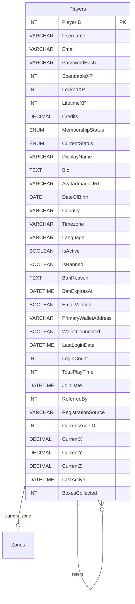

# HUBZZ Complete ERD - Core Player System

This is the complete, production-ready database schema for the Hubzz metaverse platform.

## 1. Core Player System

The player system manages user accounts, XP (HBX tokens), currency (HBC), and player profiles.

### Key Features

- **XP System (HBX Token)**: SpendableXP for gas fees, LockedXP for moderation, LifetimeXP for level badges
- **Primary Currency**: HBC balance tracked in Credits field
- **Blockchain Integration**: Ethereum wallet address support
- **Spatial Tracking**: Current zone and 3D coordinates (X, Y, Z)
