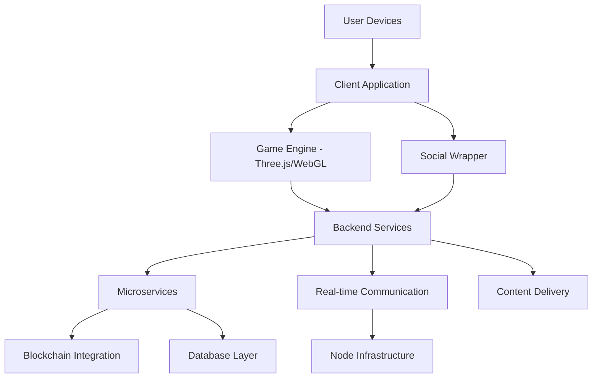
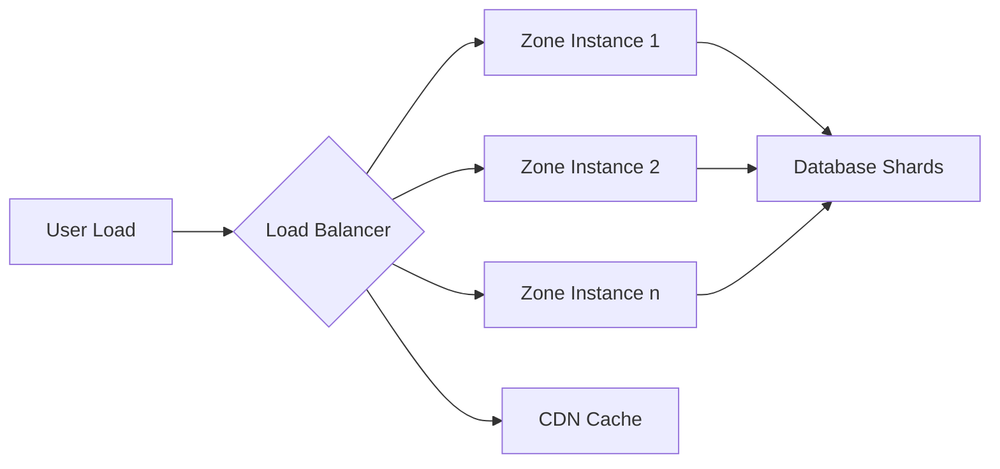
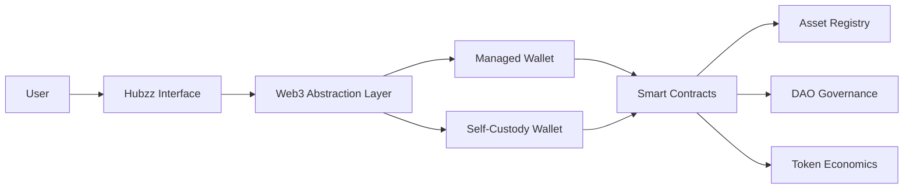

import { Tabs, Tab, Callout, Steps, Code } from 'mintlify';

# Technical Infrastructure

This section outlines the technical foundations of Hubzz, focusing on architecture, scalability, performance, and blockchain integration.

## Architecture Overview

Hubzz's architecture balances performance, accessibility, and decentralization through distinct layers:

### Client Application Layer

<Tabs>
  <Tab title="Game Engine">
    - Built on **Three.js and WebGL** for cross-device 3D rendering
    - Handles real-time interactions, spatial audio, and physics
    - Optimized for devices from mobile to VR headsets
    - Dynamic Level of Detail (LOD) based on device capabilities
  </Tab>
  <Tab title="Social Wrapper">
    - User-friendly interface for social features
    - Chat, friends lists, groups, profiles, and activity feeds
    - Maintains social connections outside the 3D environment
    - Provides seamless integration with the Dashboard
  </Tab>
</Tabs>

The client application is designed as a **Progressive Web Application (PWA)** that:
- Requires no installation or downloads
- Adapts rendering quality to match device capabilities
- Uses efficient binary protocols for data transmission
- Provides offline capabilities for certain functions

### Backend Services

Our backend architecture employs modern cloud-native principles:

- **Microservices Architecture**: Independent, scalable service components
- **Real-Time Communication**: WebSocket connections for low-latency interactions
- **Distributed Database System**: Sharded for horizontal scaling
- **Global CDN**: Edge caching for static assets and content delivery

### Hybrid Decentralization Model

Hubzz implements a balanced approach to decentralization:

<Callout type="info">
  Our infrastructure follows a progressive decentralization roadmap, starting with centralized services for performance and gradually shifting toward community-operated components.
</Callout>

- **Central Services**: Managed core platform functions (authentication, matchmaking)
- **Node Infrastructure**: Distributed nodes for performance and resilience
- **Blockchain Integration**: Smart contracts for economic transactions and ownership
- **DAO Governance**: Community input for platform development decisions

## Scalability & Performance

### Capacity Management Strategies

<Steps>
  <Step title="Zonal Instancing">
    Creating multiple instances of highly populated zones to distribute load
  </Step>
  <Step title="Dynamic Rendering">
    Adjusting visual quality based on distance, importance, and device capabilities
  </Step>
  <Step title="Proximity-Based Processing">
    Only processing interactions within relevant proximity to each user
  </Step>
  <Step title="Progressive Asset Loading">
    Loading assets based on priority and visibility to reduce initial load times
  </Step>
</Steps>

### Concurrent User Capacity

Hubzz is designed to support thousands of concurrent users through:

- **Zone Capacity Tiers**:
  - Central Zones: >4,000 users per instance
  - Mid Zones: 2,000-4,000 users per instance
  - Outer Zones: Variable based on configuration

- **Tile-Based Capacity System**: Links maximum user counts to physical space size
- **Automatic Sharding**: Creating multiple instances when zones reach capacity
- **Event-Specific Infrastructure**: Dedicated resources for high-attendance events

### Performance Monitoring

Our infrastructure includes comprehensive monitoring:

<Code language="json">
{
  "metrics": [
    "client_fps",
    "network_latency",
    "server_response_time",
    "memory_usage",
    "user_density_heatmap"
  ],
  "actions": [
    "auto_scaling",
    "instance_migration",
    "render_quality_adjustment"
  ]
}
</Code>

## Blockchain Integration

Hubzz implements blockchain technology with a "blockchain when beneficial" philosophy:

### Asset Ownership System

Our digital asset system uses blockchain to provide:

- **Verifiable Ownership**: True ownership of digital assets
- **Transparent History**: Complete provenance tracking
- **Standard Compatibility**: ERC-721/ERC-1155 standards
- **Interoperability**: Potential future compatibility with other platforms

### Invisible Web3 Approach

<Callout type="note">
  Users can enjoy Hubzz without any blockchain knowledge through our "Invisible Web3" approach.
</Callout>

- **Managed Wallets**: Custodial solutions for new users
- **Seamless Onboarding**: No crypto knowledge required
- **Progressive Exposure**: Gradual introduction to ownership concepts
- **Self-Custody Options**: Advanced users can connect their own wallets

### Blockchain Selection Criteria

Our blockchain infrastructure is selected based on:

1. **Scalability**: Transaction throughput and capacity
2. **Cost Efficiency**: Minimizing transaction fees
3. **Ecosystem Compatibility**: Developer tools and standards
4. **Environmental Impact**: Energy efficiency
5. **Security & Maturity**: Proven stability and security

### Technical Implementation

