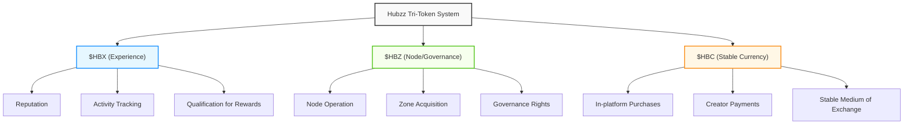

import { Card, Cards, Callout, Tabs, Tab } from 'mintlify';

# Tokenomics Overview

Hubzz utilizes an innovative **tri-token system** designed to balance user experience, platform growth, and economic stability within the metaverse ecosystem.

<Callout type="info">
  Each token serves a distinct purpose in the ecosystem, creating separation of concerns that enables better governance, controlled growth, and economic stability.
</Callout>

## The Tri-Token System

<Tabs>
  <Tab title="$HBX (Experience)">
    ### Experience Token
    
    A non-transferable reputation and activity metric that measures user engagement.
    
    - **Purpose**: Track user activity, reputation, and platform engagement
    - **Characteristics**:
      - Non-transferable (soul-bound to user accounts)
      - Infinite supply (generated through activity)
      - Revocable (for abuse prevention)
    - **Earning Methods**:
      - Completing quests and challenges
      - Attending and participating in events
      - Contributing to communities
      - Creating content and hosting events
    - **Use Cases**:
      - Unlock exclusive features and opportunities
      - Qualify for $HBZ reward programs
      - Reputation weighting for reviews and votes
      - Future gas reduction for transactions
  </Tab>
  <Tab title="$HBZ (Node/Governance)">
    ### Node/Governance Token
    
    A transferable token that incentivizes infrastructure support and ecosystem growth.
    
    - **Purpose**: Support network infrastructure, governance, and controlled expansion
    - **Characteristics**:
      - Transferable (can be traded)
      - Fixed total supply: 100 Million
      - Decreasing emission rate (halving mechanism)
    - **Earning Methods**:
      - Operating network nodes
      - Activity mining programs
      - Creator rewards for high-engagement content
      - Community building initiatives
    - **Use Cases**:
      - Required for node operation (staking)
      - Exclusive currency for Outer Zone auctions
      - Future governance voting rights
      - Convertible to $HBC for spending
  </Tab>
  <Tab title="$HBC (Stable Currency)">
    ### Stable Currency
    
    A stable medium of exchange for all platform transactions.
    
    - **Purpose**: Enable reliable pricing and frictionless transactions
    - **Characteristics**:
      - Transferable within the platform
      - Elastic supply (adjusted based on reserves)
      - Pegged to USD (64 credits = $1)
    - **Earning Methods**:
      - Direct purchase
      - Auto-conversion from $HBZ rewards
      - Sales of created content or assets
      - Event hosting revenue
    - **Use Cases**:
      - Purchase virtual properties and assets
      - Buy event tickets and merchandise
      - Creator payments and royalties
      - Trade assets on the marketplace
  </Tab>
</Tabs>

## Token Interaction Model

The three tokens work together in a complementary system:

1. **Activity → Rewards**: Users earn $HBX through platform engagement, which qualifies them for $HBZ rewards
2. **Infrastructure → Growth**: $HBZ incentivizes node operation and infrastructure support for platform scaling
3. **Stability → Usability**: $HBC provides a reliable medium of exchange with stable value for all transactions

<Callout type="note">
  The separation of tokens ensures that speculation ($HBZ) doesn't impact day-to-day transactions ($HBC), while reputation and engagement ($HBX) remain tied to actual user activity.
</Callout>

## Platform Evolution Journey

Hubzz's token system has evolved to balance accessibility with robust economics:

### Phase 1: Soft Currency (Initial Launch)
- Basic credit system for simple transactions
- No blockchain integration required
- Focus on accessibility for mainstream users

### Phase 2: Hybrid Model (Current)
- $HBC stablecoin for reliable transactions
- $HBX for tracking engagement
- Limited $HBZ distribution for early infrastructure

### Phase 3: Full Tri-Token (Future)
- Complete implementation of all three tokens
- Enhanced governance through $HBZ
- Expanded node network powered by token incentives

For detailed information on token distribution, revenue models, and reward systems, explore the sections below:

<Cards>
  <Card
    title="Token Distribution"
    icon="chart-pie"
    href="/tokenomics/distribution"
  >
    Learn about emission schedules, allocation categories, and distribution mechanisms.
  </Card>
  <Card
    title="Revenue Model"
    icon="money-bill-wave"
    href="/tokenomics/revenue"
  >
    Understand platform fees, monetization strategies, and value flows.
  </Card>
  <Card
    title="Reward Systems"
    icon="gift"
    href="/tokenomics/rewards"
  >
    Explore how users, creators, and node operators are incentivized.
  </Card>
</Cards> 